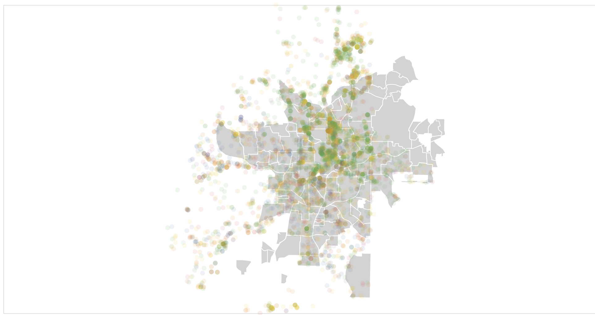
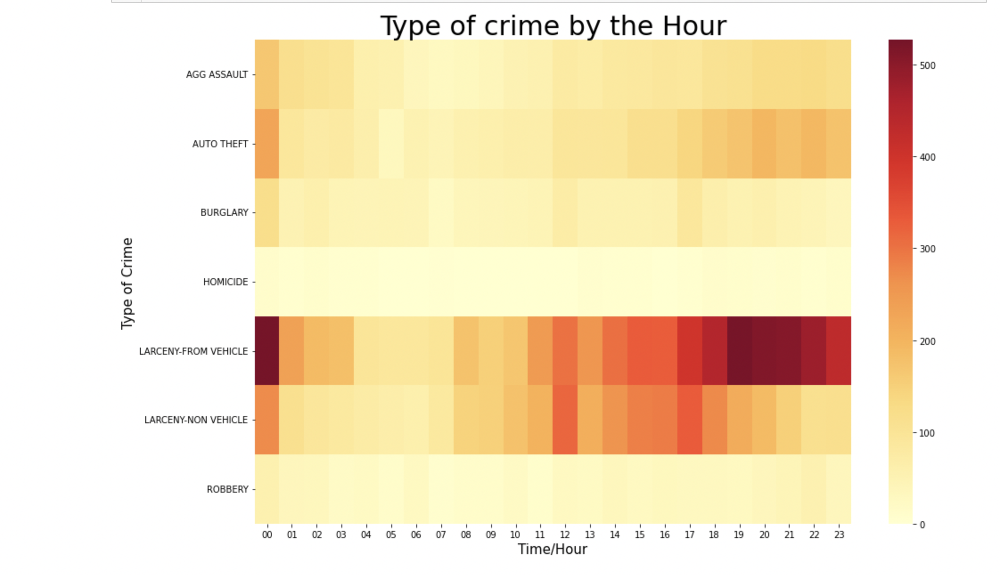
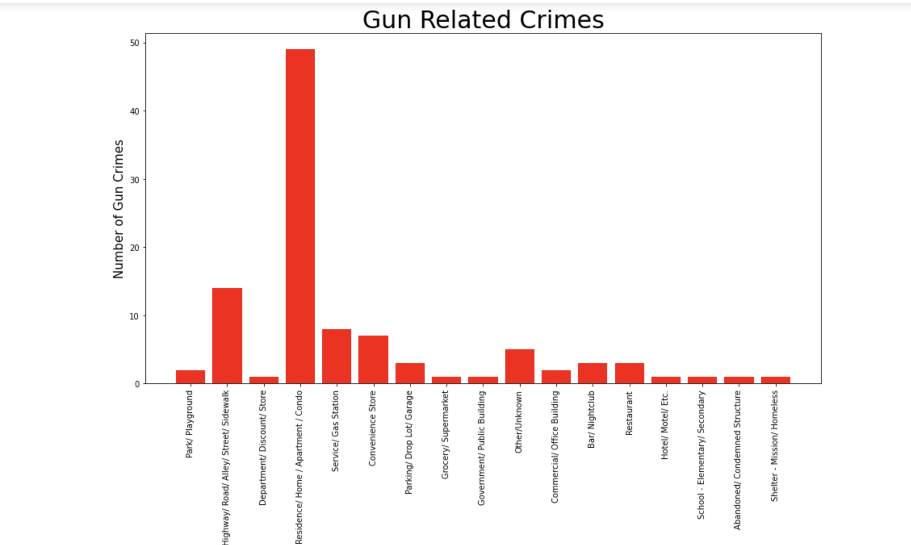
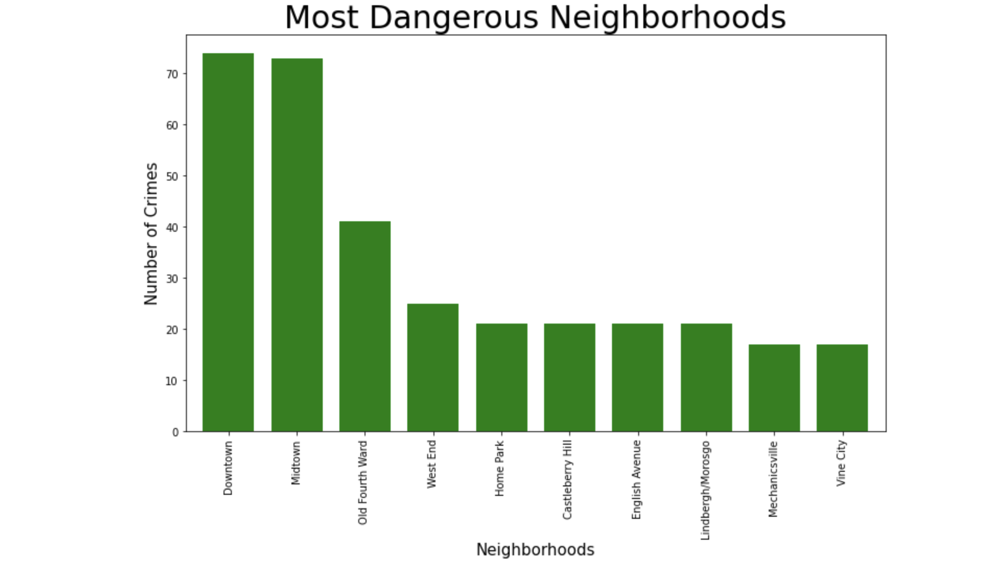

# Crime Analysis on Atlanta

This project performs data analysis on crime in Atlanta using the Atlanta Police Department's API and a 2021 CSV dataset. The project utilizes various libraries such as matplotlib, pandas, Altair, Vega datasets, NumPy, requests, BeautifulSoup, and more.

## License

This project is licensed under the [MIT License](LICENSE). Feel free to modify and distribute it as per the terms of the license.

## Acknowledgments

- Atlanta Police Department for providing the API and data.
- The contributors of the libraries used in this project for their excellent work.

## Disclaimer

Please note that the analysis and conclusions presented in this project are based on publicly available data and should be used for informational purposes only. The authors make no claims about the accuracy or completeness of the information. Always refer to official sources for the latest and most reliable crime statistics in Atlanta.

